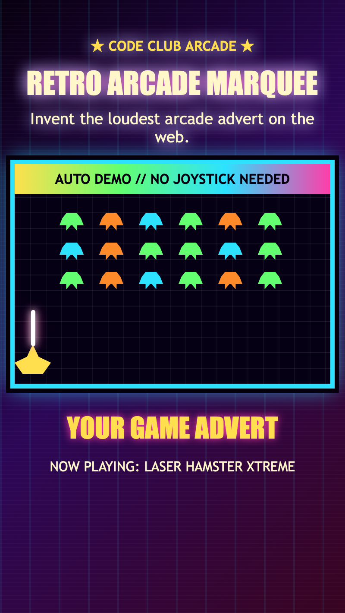

<h2 class="c-project-heading--task">Add the promo text</h2>

Add a scrolling advert area above the arcade demo.

`marquee.css` is already linked in the page, so begin by putting the marquee HTML inside the `promo-zone` section of `index.html`.

--- code ---
---
language: html
filename: index.html
line_numbers: true
line_number_start: 18
line_highlights: 21-22
---
      <section class="promo-zone" aria-labelledby="promo-title">
        <h2 id="promo-title">Promo:</h2>
        <!-- Add your scrolling promo inside this section. -->
        

          
Now playing: Laser Hamster Xtreme

        

      </section>
--- /code ---

<h2 class="c-project-heading--task">Test</h2>

Your promo words should appear above the retro invaders demo.

  

