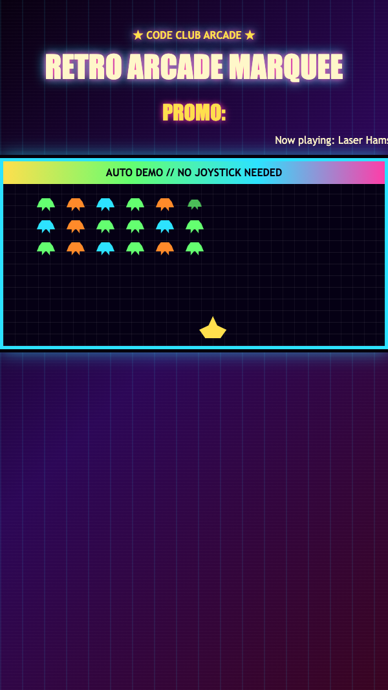

<h2 class="c-project-heading--task">Make the words scroll</h2>

Use CSS animation to move the message from right to left.

Add your first marquee rules to `marquee.css`.

--- code ---
---
language: css
filename: marquee.css
line_numbers: true
line_number_start: 1
line_highlights: 2-18
---
/* Add your scrolling marquee styles in this file. */
.marquee {
  overflow: hidden;
}

.marquee-text {
  display: inline-block;
  min-width: max-content;
  margin: 0;
  white-space: nowrap;
  animation: scroll-left 11s linear infinite;
}

/* Move the whole message across the sign. */
@keyframes scroll-left {
  from {
    transform: translateX(100%);
  }

  to {
    transform: translateX(-100%);
  }
}
--- /code ---

<h2 class="c-project-heading--task">Test</h2>

Your message should slide across the page above the arcade demo.

  

