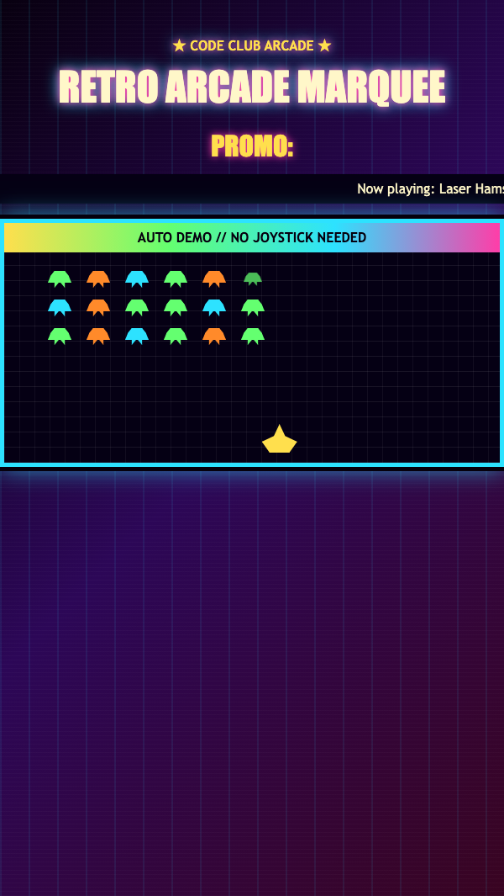

<h2 class="c-project-heading--task">Build the sign panel</h2>

Give the moving text a dark sign to travel across.

Update the `.marquee` rule in `marquee.css`.

--- code ---
---
language: css
filename: marquee.css
line_numbers: true
line_number_start: 2
line_highlights: 4-5
---
.marquee {
  overflow: hidden;
  padding: 8px 0;
  background: #050014;
}
--- /code ---

<h2 class="c-project-heading--task">Test</h2>

Your message should now move across a dark marquee strip.

  

