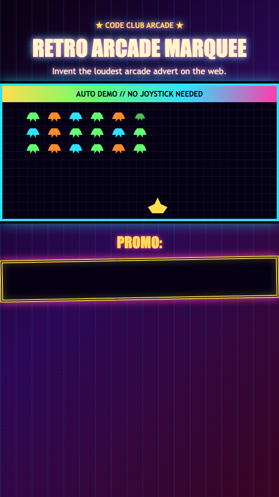

<h2 class="c-project-heading--task">Add arcade glow</h2>

Turn the strip into a proper arcade sign with a border, a glow, and a slight tilt.

Keep working in the `.marquee` rule in `marquee.css`.

--- code ---
---
language: css
filename: marquee.css
line_numbers: true
line_number_start: 2
line_highlights: 6-8
---
.marquee {
  overflow: hidden;
  padding: 8px 0;
  background: #050014;
  border: 6px double var(--yellow);
  box-shadow: 0 0 18px var(--pink), inset 0 0 18px rgba(255, 223, 77, 0.25);
  transform: rotate(-1deg);
}
--- /code ---

<h2 class="c-project-heading--task">Test</h2>

Your marquee should glow and lean a tiny bit like an arcade sign.

  

