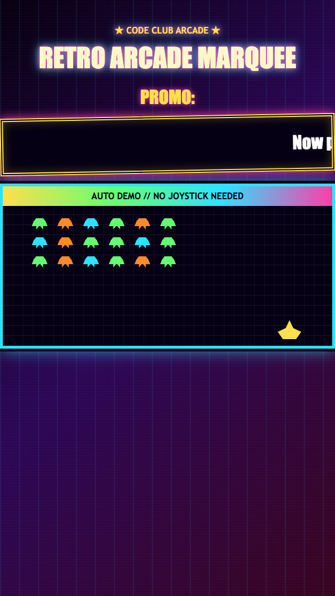

<h2 class="c-project-heading--task">Style the letters</h2>

Make the words brighter, bigger, and easier to read.

Now update the `.marquee-text` rule in `marquee.css`.

--- code ---
---
language: css
filename: marquee.css
line_numbers: true
line_number_start: 10
line_highlights: 16-19
---
.marquee-text {
  display: inline-block;
  min-width: max-content;
  margin: 0;
  white-space: nowrap;
  animation: scroll-left 11s linear infinite;
  padding: 18px 0;
  color: #ffffff;
  font-family: Impact, "Arial Black", sans-serif;
  font-size: 2rem;
}
--- /code ---

<h2 class="c-project-heading--task">Test</h2>

The message should look larger and brighter as it scrolls past.

  

