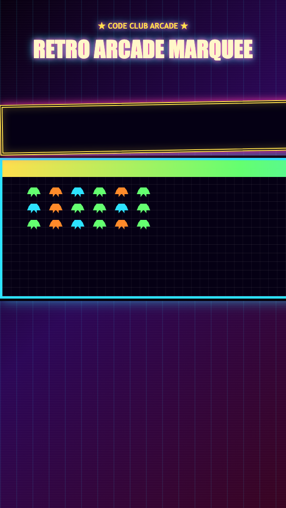

<h2 class="c-project-heading--task">Finish the advert</h2>

Add the last dramatic text effects, then change the message to advertise your own ridiculous game.

First, finish the `.marquee-text` rule in `marquee.css`.

--- code ---
---
language: css
filename: marquee.css
line_numbers: true
line_number_start: 11
line_highlights: 19-23
---
.marquee-text {
  display: inline-block;
  min-width: max-content;
  margin: 0;
  padding: 18px 0;
  color: #ffffff;
  font-family: Impact, "Arial Black", sans-serif;
  font-size: 2rem;
  font-weight: 900;
  letter-spacing: 0.08em;
  text-shadow: 3px 3px 0 var(--pink), 6px 6px 0 var(--purple);
  text-transform: uppercase;
  white-space: nowrap;
  animation: scroll-left 11s linear infinite;
}
--- /code ---

--- code ---
---
language: html
filename: index.html
line_numbers: true
line_number_start: 21
line_highlights: 23
---
        

          

            NOW PLAYING: LASER HAMSTER XTREME &#9889; WIN THE GALAXY &#9889; FREE LASERS WITH EVERY MOON BURGER
          

        

--- /code ---

<h2 class="c-project-heading--task">Test</h2>

Your marquee should now look loud and dramatic, and the words should advertise your own arcade game idea.

  

